# Project-2:-

# Blue-Green Deployment using Jenkins and AWS

## Project Overview

This project demonstrates a **Blue-Green Deployment strategy** using AWS infrastructure and Jenkins CI/CD pipeline.
The goal is to achieve **zero-downtime deployments**, **automatic failover**, and **traffic switching** between environments.

Two environments are used:

* **Blue Environment** – Existing production version
* **Green Environment** – New version deployed for testing

Traffic is managed through an **Application Load Balancer**, and deployments are automated using Jenkins.

---
## Architecture Diagram:
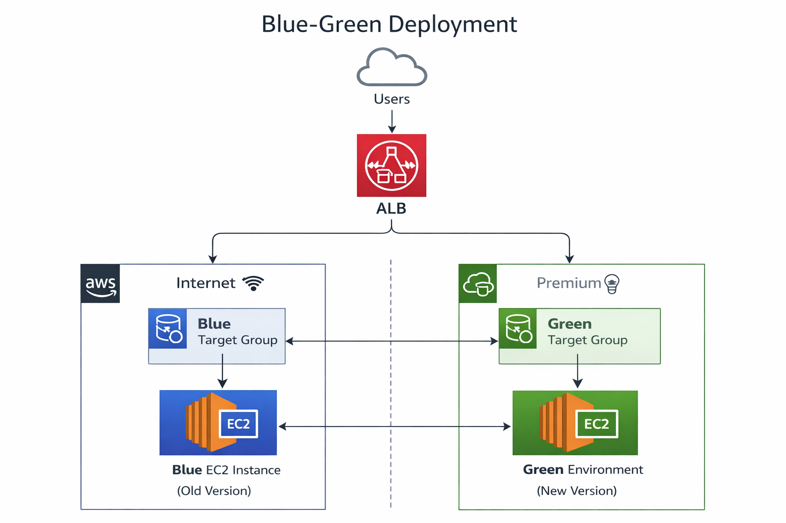
---
## Architecture Design:

User traffic is routed through an AWS Application Load Balancer which forwards requests to either the Blue or Green environment depending on health and deployment state.

```
                 Users
                   │
                   ▼
           Application Load Balancer
                   │
        ┌──────────┴──────────┐
        │                     │
     Blue Target Group     Green Target Group
        │                     │
      Blue EC2              Green EC2
   (Old Version)         (New Version)
```

---

## Tools and Technologies:

* AWS EC2
* AWS Application Load Balancer
* AWS Target Groups
* Jenkins
* GitHub
* Nginx
---

## Infrastructure Setup:
### EC2 Instances Running:
Three servers are running in this architecture:
- Jenkins Server – Used for CI/CD pipeline execution
- Blue Environment Server – Runs the current production version
- Green Environment Server – Runs the new deployment version

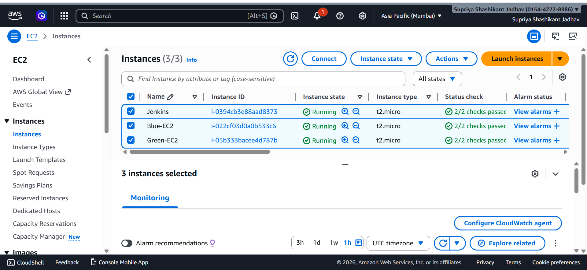
---

## Target Group Health Status:
Both Blue and Green environments remain healthy.
#### Blue Target Group:
- Blue-TG → Healthy
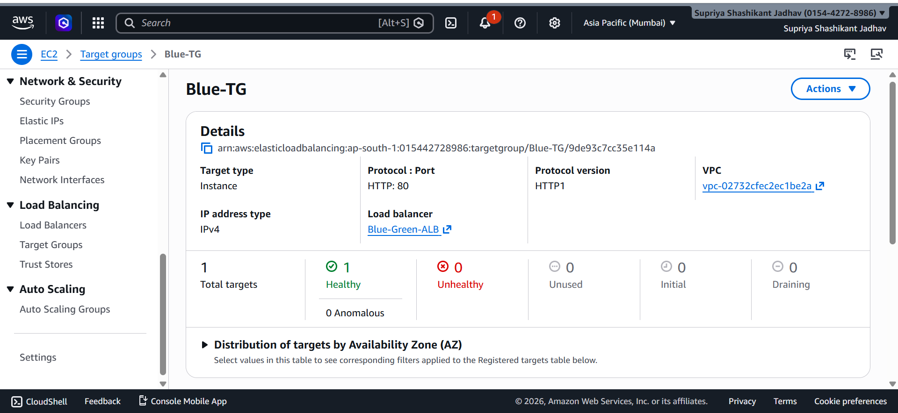

#### Green Target Group:
- Green-TG → Healthy
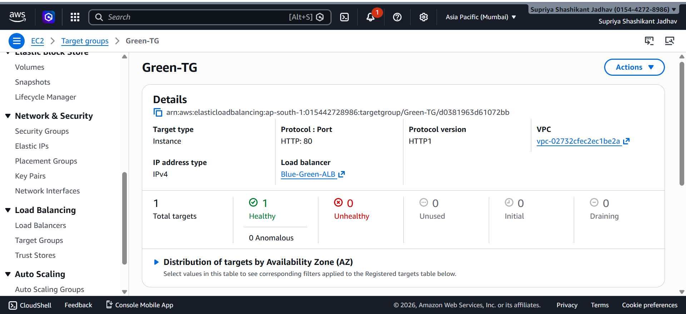

This setup ensures **instant rollback capability if the new deployment fails.**

---

## ALB Traffic Routing:
### Traffic Forwarded to Blue:
- If the Green environment becomes unhealthy, traffic automatically switches back to the **Blue Target Group.**

Listener → Forward → Blue Target Group

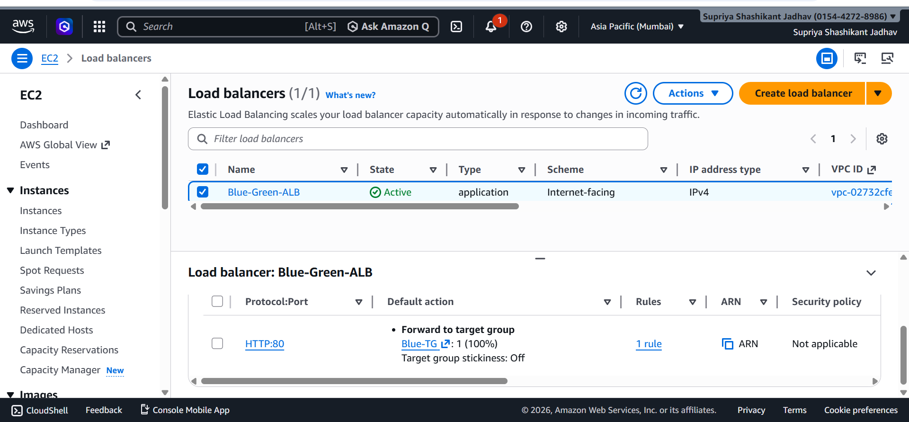

### Traffic Forwarded to Green:
- Application Load Balancer forwards traffic to the **Green Target Group** when the new deployment is successful.

Listener → Forward → Green Target Group

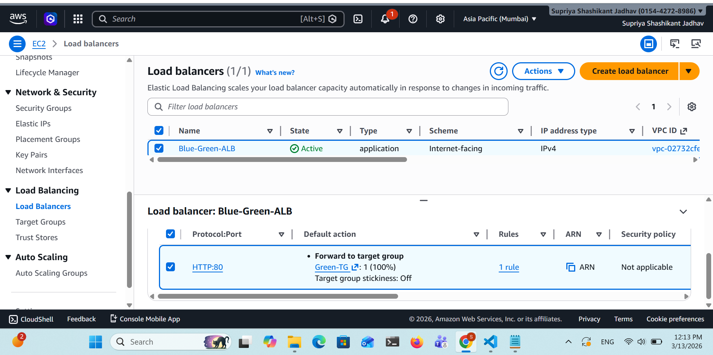

---

## Application Output:
### Blue Environment Output:
- This environment runs the **previous stable version** of the application.

Example Output:

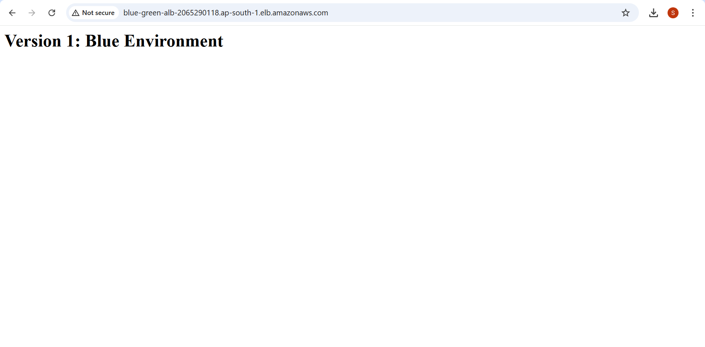

### Green Environment Output:
- This environment runs the **new deployment version** of the application.

Example Output:

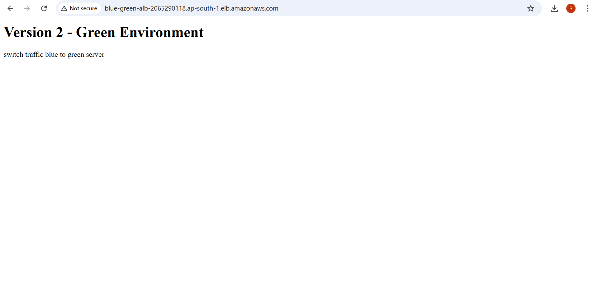

---

## Jenkins Pipeline Execution:
### Successful Deployment (Healthy):
When deployment succeeds:
- Code is deployed to Green Environment
- Health checks are verified
- ALB traffic switches to Green Target Group

```
Pipeline Result: SUCCESS
Traffic → Green Environment
```
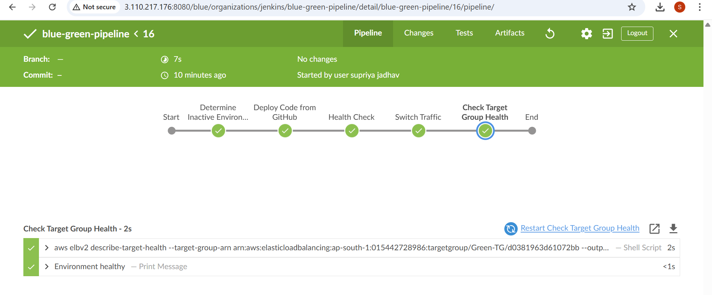

---

## Automatic Rollback Demonstration:
- If the **Green environment becomes unhealthy,** Jenkins automatically performs rollback.

**Example Failure Scenario**

Green-TG → Unhealthy

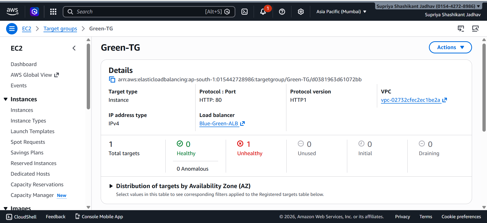
Rollback Process:
1. Jenkins detects health check failure
2. Traffic automatically switches back to Blue Target Group
3. Application remains available without downtime


---

## Pipeline Failure (Unhealthy Green):

**If deployment fails:**

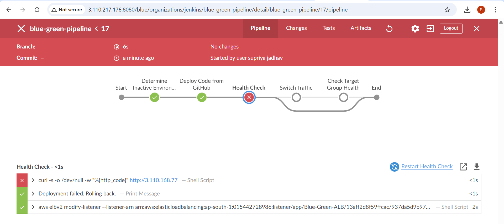
```
Pipeline Result: FAILURE
Traffic → Blue Environment
```
**Listener automatically forwards traffic back to Blue.**

Listener → Forward → Blue Target Group


---

## Benefits of Blue-Green Deployment:

* Zero downtime deployment
* Instant rollback capability
* Safe testing of new versions
* Reduced production risk

---

## Future Improvements:

* Integrate monitoring with CloudWatch
* Add Slack or email notifications
* Implement Infrastructure as Code using Terraform
* Automate scaling using Auto Scaling Groups

---

## Conclusion:

This project demonstrates a **production-style Blue-Green deployment pipeline** using AWS and Jenkins.
It ensures reliable deployments, high availability, and seamless traffic switching between environments.

---

## Author:

**Supriya Jadhav**
